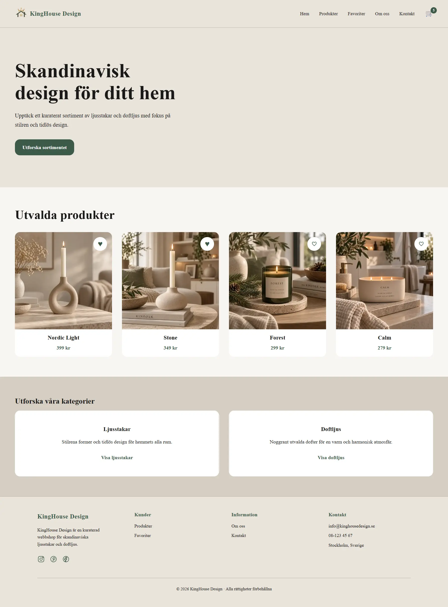
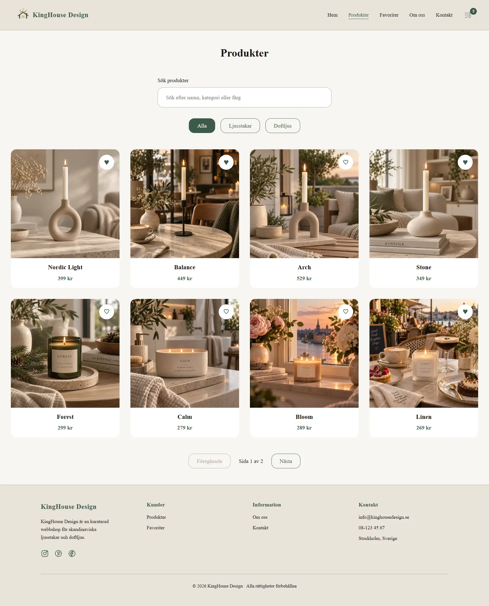
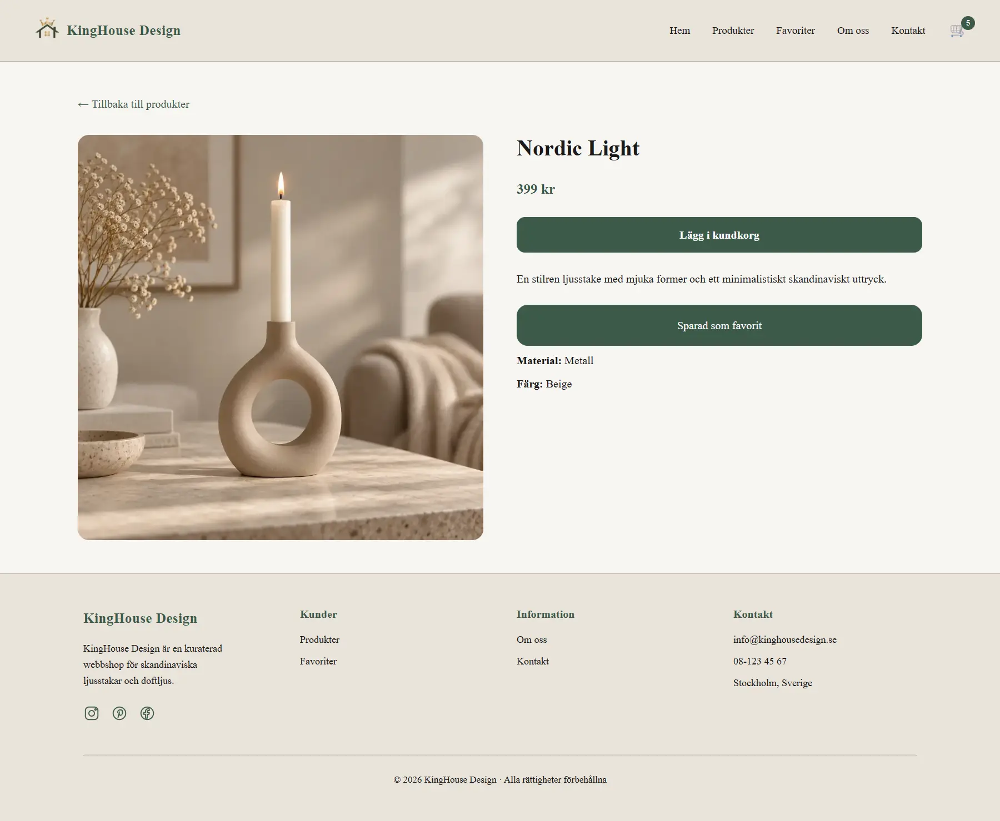
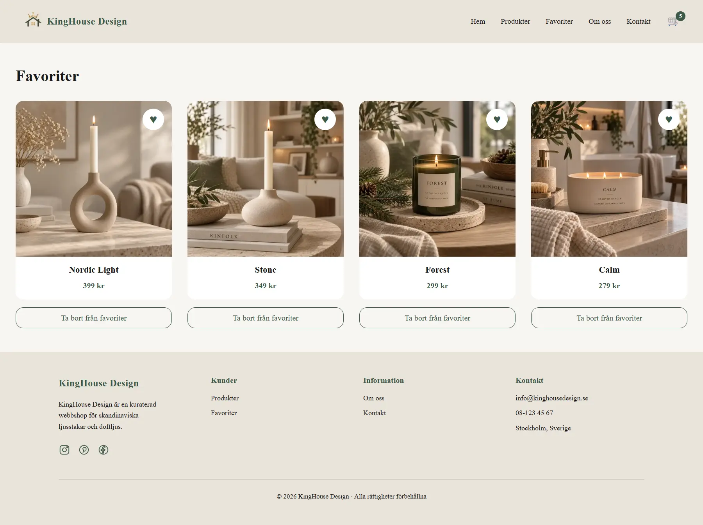
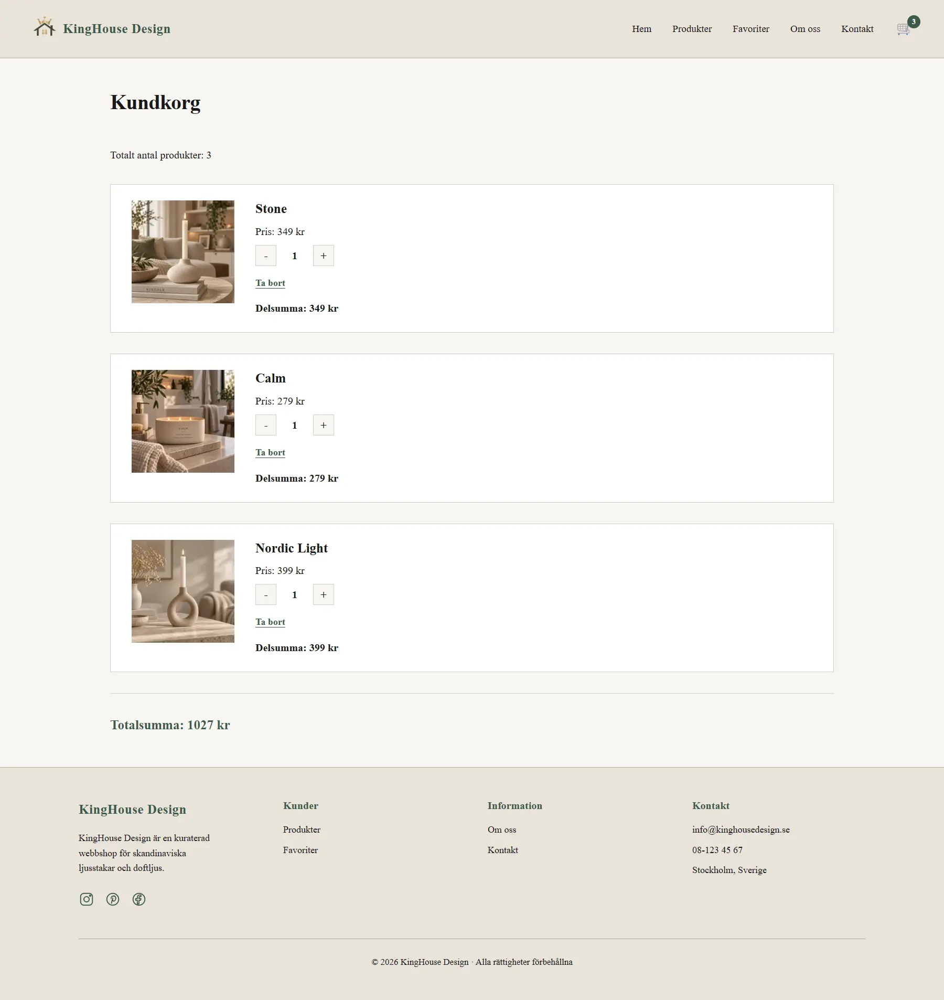
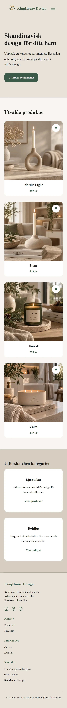

# KingHouse Design

KingHouse Design är en responsiv webbshop byggd med **Next.js, React och TypeScript**. Projektet fokuserar på ett kuraterat sortiment av skandinaviska ljusstakar och doftljus, med ett varmt, minimalistiskt och användarvänligt gränssnitt.

Projektet är utvecklat med fokus på **responsiv design, komponentbaserad utveckling, tillgänglighet, prestanda och en tydlig användarupplevelse**.

## Live demo

Webbplatsen är publicerad på Netlify:

**Live demo:**  
https://kinghousedesign.netlify.app/

**GitHub repository:**  
https://github.com/KingaSzayer-Iths/kinghouse-nextjs

---

## Om projektet

KingHouse Design bygger på idén om en mindre och mer genomtänkt webbshop där användaren inte behöver navigera genom hundratals produkter för att hitta något som passar.

Sortimentet består av skandinaviska ljusstakar och doftljus som valts ut med fokus på form, färg, material och en varm, minimalistisk känsla.

Projektet kombinerar frontendutveckling med UI/UX och innehåller funktioner som produktsökning, filtrering, paginering, favoriter och kundkorg.

---

## Problem och målgrupp

### Problem

Stora e-handelsplattformar kan innehålla mycket omfattande sortiment, vilket kan göra det svårt och tidskrävande för användaren att hitta produkter som passar en viss stil.

KingHouse Design utgår därför från ett mer kuraterat koncept där ett mindre antal produkter presenteras på ett tydligt och visuellt sammanhållet sätt.

Målet är att göra det enklare och mer inspirerande att hitta inredningsdetaljer utan att användaren behöver navigera genom ett stort antal alternativ.

### Målgrupp

Webbshoppen riktar sig främst till personer som:

- är intresserade av skandinavisk och minimalistisk inredning
- uppskattar ett mindre och noggrant utvalt sortiment
- söker ljusstakar och doftljus för att skapa en varm och harmonisk känsla i hemmet
- vill kunna hitta och spara produkter på ett enkelt sätt
- använder både desktop, surfplatta och mobil

---

## Funktioner

### Produktöversikt

Alla produkter presenteras i återanvändbara produktkort med:

- produktbild
- produktnamn
- pris
- favoritknapp
- länk till produktens detaljsida

Produkterna hämtas från den lokala datafilen `src/data/products.json`.

### Sökfunktion

På produktsidan kan användaren söka efter produkter.

Sökningen matchar bland annat:

- produktnamn
- kategori
- färg

Sökningen är inte skiftlägeskänslig och uppdaterar produktlistan utifrån användarens sökterm.

### Filtrering

Produkterna kan filtreras efter:

- Alla
- Ljusstakar
- Doftljus

När användaren byter filter återställs pagineringen automatiskt till första sidan.

### Paginering

Produktöversikten visar **8 produkter per sida**.

Användaren kan navigera mellan sidorna med knapparna **Föregående** och **Nästa**.

### Produktdetaljer

Varje produkt har en dynamisk produktsida baserad på produktens `slug`.

Produktsidan visar bland annat:

- produktbild
- namn
- pris
- beskrivning
- material
- färg
- doft för doftljus
- knapp för att lägga produkten i kundkorgen
- knapp för att spara produkten som favorit

Om en produkt inte kan hittas används Next.js `notFound()` och användaren skickas till projektets anpassade 404-sida.

### Favoriter

Användaren kan spara produkter som favoriter både från produktkorten och från produktens detaljsida.

Favoriterna lagras i webbläsarens `localStorage`, vilket innebär att de finns kvar efter att sidan laddas om i samma webbläsare.

På favoritsidan kan användaren:

- se sina sparade produkter
- öppna produktens detaljsida
- ta bort produkter från favoriter

### Kundkorg

Produkter kan läggas till i kundkorgen från produktens detaljsida.

Kundkorgen använder `localStorage` och innehåller funktionalitet för att:

- lägga till produkter
- öka antal
- minska antal
- ta bort produkter
- visa delsumma per produkt
- visa totalt antal produkter
- beräkna totalsumman

Headern visar dessutom aktuellt antal produkter i kundkorgen.

När kundkorgen ändras skickas ett eget `cartUpdated`-event så att exempelvis kundkorgsräknaren i headern kan uppdateras direkt.

### Kontaktformulär

Kontaktsidan innehåller ett formulär med:

- namn
- e-post
- ämne
- meddelande

Formuläret använder HTML-validering och visar en bekräftelse efter att användaren skickat formuläret.

Formuläret är i nuläget en **frontend-demo** och skickar inte informationen till någon backend eller e-posttjänst.

### Responsiv navigation

Headern anpassas efter skärmstorleken.

På större skärmar visas den fullständiga navigationen och på mindre skärmar används en hamburgermeny.

Navigationen innehåller länkar till:

- Hem
- Produkter
- Favoriter
- Om oss
- Kontakt
- Kundkorg

### Anpassad 404-sida

Projektet innehåller en egen 404-sida som följer KingHouse Designs visuella identitet.

Sidan använder en stiliserad slocknad ljuslåga och erbjuder tydliga länkar tillbaka till:

- startsidan
- produktsidan

---

## Skärmbilder

### Startsida



### Produkter

Produktsidan innehåller sökning, kategorifiltrering, favoriter och paginering.



### Produktdetaljer

Produktdetaljsidan visar information om produkten och ger användaren möjlighet att lägga produkten i kundkorgen eller spara den som favorit.



### Favoriter

Användaren kan samla produkter i en personlig favoritlista.



### Kundkorg

Kundkorgen hanterar antal, borttagning, delsummor och totalpris.



### Mobilvy

Webbplatsen är responsiv och anpassar layout, navigation, produktkort och footer efter mindre skärmar.



---

## Teknikval

Projektet är byggt med följande tekniker:

### Next.js 16

Next.js används som ramverk och projektet bygger på **App Router**.

Det ger bland annat:

- filbaserad routing
- layouts
- dynamiska routes
- optimerad bildhantering
- metadata
- stöd för både server- och client components

### React 19

React används för att bygga det komponentbaserade användargränssnittet.

Interaktiva delar använder bland annat:

- `useState`
- `useEffect`
- återanvändbara komponenter
- props

### TypeScript

TypeScript används för att skapa tydligare och säkrare kod.

Projektet innehåller bland annat typer för produkter och kundkorg.

Exempel:

```ts
export interface Product {
  id: string;
  slug: string;
  name: string;
  category: "candlestick" | "scented-candle";
  price: number;
  description: string;
  material: string;
  color: string;
  image: string;
  alt: string;
  featured: boolean;
  scent?: string;
}
```

Kundkorgens datastruktur:

```ts
export interface CartItem {
  productId: string;
  quantity: number;
}
```

### CSS Modules

Komponenter och sidor använder CSS Modules för lokal styling.

Det gör det möjligt att hålla styling separerad mellan olika komponenter och minskar risken för konflikter mellan klassnamn.

Projektet använder dessutom globala CSS-variabler för bland annat:

- färger
- spacing
- typografi
- bakgrunder
- borders
- fokusfärger

### Next Image

`next/image` används för produktbilder och andra större bilder.

Bilderna använder bland annat:

- definierad `width` och `height`
- responsiva `sizes`
- alt-texter
- kontrollerad eager loading för viktiga bilder

Detta hjälper till att förbättra både responsivitet och prestanda.

### next/font

Projektet använder **Geist** via Next.js `next/font`.

Fonten laddas och optimeras av Next.js och används genom en global CSS-variabel.

### localStorage

`localStorage` används för att lagra:

- favoriter
- kundkorg

Det gör att användarens val finns kvar efter en siduppdatering utan att projektet behöver en backend eller databas.

---

## Produktdata

Produktinformationen finns lokalt i:

```text
src/data/products.json
```

Applikationen behöver därför ingen separat API-server för att hämta produkterna.

Produktdatan innehåller bland annat:

- id
- slug
- namn
- kategori
- pris
- beskrivning
- material
- färg
- bild
- alt-text
- featured-status
- doft för doftljus

Projektet innehåller två produktkategorier:

```text
candlestick
scented-candle
```

---

## Projektstruktur

En förenklad översikt över projektets struktur:

```text
kinghouse-nextjs/
│
├── public/
│   └── images/
│       ├── products/
│       └── readme/
│
├── src/
│   ├── app/
│   │   ├── about/
│   │   ├── cart/
│   │   ├── contact/
│   │   ├── favorites/
│   │   ├── products/
│   │   │   └── [slug]/
│   │   ├── layout.tsx
│   │   ├── not-found.tsx
│   │   └── page.tsx
│   │
│   ├── components/
│   │   ├── AddToCartButton/
│   │   ├── FavoriteButton/
│   │   ├── FavoriteIconButton/
│   │   ├── FavoritesList/
│   │   ├── Footer/
│   │   ├── Header/
│   │   ├── ProductCard/
│   │   └── ProductList/
│   │
│   ├── data/
│   │   └── products.json
│   │
│   ├── lib/
│   │   └── products.ts
│   │
│   └── types/
│       ├── CartItem.ts
│       └── Product.ts
│
├── package.json
├── tsconfig.json
└── README.md
```

---

## Tillgänglighet

Tillgänglighet har varit en viktig del av utvecklingen.

Projektet använder bland annat:

- semantiska HTML-element
- korrekt rubrikstruktur
- `<main>`, `<header>`, `<footer>`, `<nav>` och `<address>`
- alt-texter för produktbilder
- labels kopplade till formulärfält
- `aria-label` på ikonknappar
- `aria-expanded` på mobilmenyn
- `aria-controls` för navigationen
- `aria-hidden` för dekorativa element
- `role="status"` för bekräftelsen i kontaktformuläret
- skip-link för att hoppa direkt till huvudinnehållet

Exempelvis finns följande skip-link globalt:

```text
Hoppa till huvudinnehåll
```

Det gör det möjligt för tangentbordsanvändare att hoppa förbi navigationen.

---

### Tillgänglighetstestning

KingHouse Design har testats med **WAVE (Web Accessibility Evaluation Tool)** som en del av tillgänglighetsarbetet.

Följande sidtyper har testats:

- startsidan
- produktöversikten
- produktdetaljsidan
- favoriter
- kundkorgen
- Om oss
- kontaktformuläret
- 404-sidan

Samtliga testade sidor hade:

- **0 WAVE Errors**
- **0 Contrast Errors**
- **AIM Score mellan 9.9 och 10 av 10**

WAVE identifierade även ett mindre antal alerts, exempelvis möjliga rubriker, hopp i rubriknivåer och redundanta länkar. Dessa har granskats som manuella kontrollpunkter eftersom en WAVE-alert inte automatiskt innebär att ett tillgänglighetsfel finns.

WAVE-testningen används som ett komplement till den manuella granskningen av bland annat semantisk HTML, rubrikstruktur, alternativtexter, formulär, ARIA-attribut och tangentbordsnavigering.

---

## Responsiv design

KingHouse Design är utvecklad för att fungera på olika skärmstorlekar.

Layouten anpassas för:

- desktop
- surfplatta
- mobil

På mindre skärmar förändras bland annat:

- huvudnavigationen till hamburgermeny
- produktgrid till färre kolumner
- produktdetaljens layout
- kategorisektioner
- footer
- spacing och innehållsbredd

Responsiva bildstorlekar anges även med `sizes` i Next.js Image-komponenter.

---

## Prestanda och optimering

Projektet har utvecklats med fokus på god prestanda och har testats med Lighthouse under utvecklingen.

Några av optimeringarna är:

- `next/image`
- responsiva `sizes`
- optimerad bildstorlek
- eager loading för utvalda bilder som kan bli LCP-element
- återanvändbara komponenter
- lokal produktdata utan externa API-anrop
- statisk rendering där det är lämpligt
- Next.js fontoptimering

Särskild hänsyn har tagits till **Largest Contentful Paint (LCP)** genom att viktiga produktbilder ovanför folden kan laddas tidigt.

---

## Lokal setup

För att köra projektet lokalt behöver du ha **Node.js** och **npm** installerat.

### 1. Klona projektet

```bash
git clone https://github.com/KingaSzayer-Iths/kinghouse-nextjs.git
```

### 2. Gå till projektmappen

```bash
cd kinghouse-nextjs
```

### 3. Installera dependencies

```bash
npm install
```

### 4. Starta utvecklingsservern

```bash
npm run dev
```

### 5. Öppna projektet

Öppna:

```text
http://localhost:3000
```

i webbläsaren.

Produktdatan läses direkt från:

```text
src/data/products.json
```

Det krävs därför ingen separat backend eller API-server för att köra webbshoppen lokalt.

---

## Scripts

Följande npm-scripts finns i projektet:

```bash
npm run dev
```

Startar Next.js utvecklingsserver.

```bash
npm run build
```

Skapar en optimerad produktionsbuild.

```bash
npm run start
```

Startar den byggda produktionsversionen.

```bash
npm run lint
```

Kör ESLint för att kontrollera kodkvaliteten.

---

## Deployment

Projektet är deployat på **Netlify**.

Live-version:

https://kinghousedesign.netlify.app/

Projektet byggs för produktion med:

```bash
npm run build
```

Produktdatan läses direkt från projektets lokala JSON-fil, vilket gör att deploymenten inte är beroende av en separat lokal API-server.

---

## Kända begränsningar

KingHouse Design är i nuläget ett frontendprojekt och inte en komplett produktionsklar e-handelsplattform.

Några nuvarande begränsningar är:

- ingen backend
- ingen extern databas
- inga användarkonton
- ingen autentisering eller auktorisering
- favoriter sparas endast i användarens webbläsare
- kundkorgen sparas endast i användarens webbläsare
- ingen checkout
- ingen betalningslösning
- inga leveransalternativ
- ingen orderhantering
- ingen lagerhantering
- kontaktformuläret skickar inte data till en server
- sociala medier-länkarna är för närvarande endast visuella placeholders

Eftersom kundkorg och favoriter använder `localStorage` följer informationen inte med mellan olika enheter eller webbläsare.

---

## Möjliga nästa steg

Projektet kan vidareutvecklas till en mer komplett e-handelslösning.

### Backend och databas

Produktdata, användare och beställningar skulle kunna flyttas från lokal JSON-data till en riktig backend och databas.

### Inloggning och autentisering

Användare skulle kunna skapa egna konton och logga in.

Det skulle göra det möjligt att koppla bland annat:

- favoriter
- kundkorg
- profilinformation
- adresser
- orderhistorik

till ett specifikt användarkonto.

### Auktorisering

Olika behörighetsnivåer skulle kunna införas, exempelvis:

- kund
- administratör

En administratör skulle exempelvis kunna hantera produkter, priser, lager och beställningar.

### Checkout

En komplett checkout skulle kunna läggas till där användaren kan:

- granska sin beställning
- ange kontaktuppgifter
- ange leveransadress
- välja leveransalternativ
- välja betalningsmetod

### Betalning

Projektet skulle kunna integreras med en betalningsleverantör, exempelvis Stripe eller Klarna.

### Leveransalternativ

Checkouten skulle kunna erbjuda olika leveransalternativ med information om:

- fraktkostnad
- leveranstid
- utlämningsställe
- hemleverans

### Orderhantering

Efter genomförd beställning skulle användaren kunna få:

- orderbekräftelse
- ordernummer
- orderhistorik
- aktuell orderstatus

### Produktadministration

En framtida administrationsvy skulle kunna göra det möjligt att:

- lägga till produkter
- redigera produkter
- ta bort produkter
- ändra priser
- uppdatera lagerstatus
- hantera produktbilder

### Kontaktformulär

Kontaktformuläret kan kopplas till en backend eller extern tjänst så att meddelanden faktiskt skickas och kan hanteras av kundservice.

---

## Fokus och lärdomar

Under utvecklingen av KingHouse Design har fokus legat på att kombinera teknisk frontendutveckling med en genomtänkt användarupplevelse.

Projektet har bland annat gett praktisk erfarenhet av:

- Next.js App Router
- React och komponentbaserad utveckling
- TypeScript
- dynamiska routes
- state och client-side interaktivitet
- `localStorage`
- sökning och filtrering
- paginering
- responsiv design
- tillgänglighet
- bildoptimering
- Lighthouse och prestandaarbete
- Git och GitHub
- deployment med Netlify

En viktig del av projektet har varit att arbeta med både funktionalitet och detaljer i gränssnittet för att skapa en sammanhängande och användarvänlig webbshop.

---

## Författare

**Kinga Szayer**

Frontendutveckling med fokus på bland annat React, TypeScript, responsiv design, UI/UX och tillgänglighet.

GitHub:  
https://github.com/KingaSzayer-Iths

---

## Länkar

**Live demo:**  
https://kinghousedesign.netlify.app/

**GitHub repository:**  
https://github.com/KingaSzayer-Iths/kinghouse-nextjs